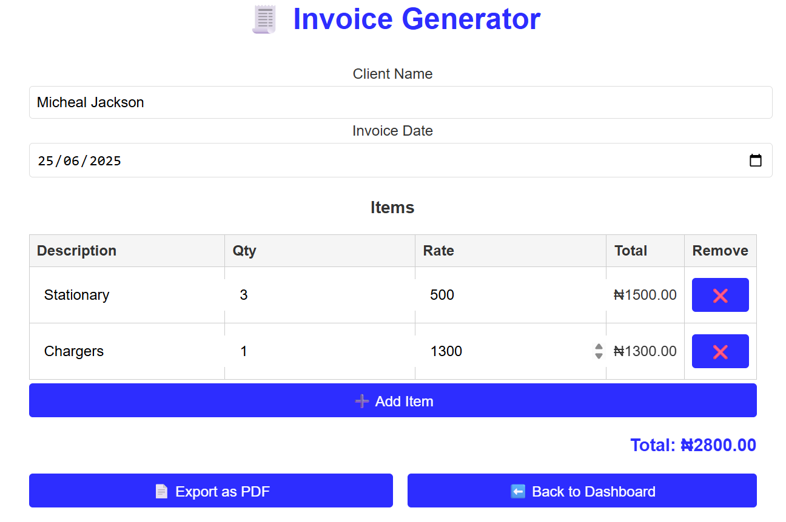
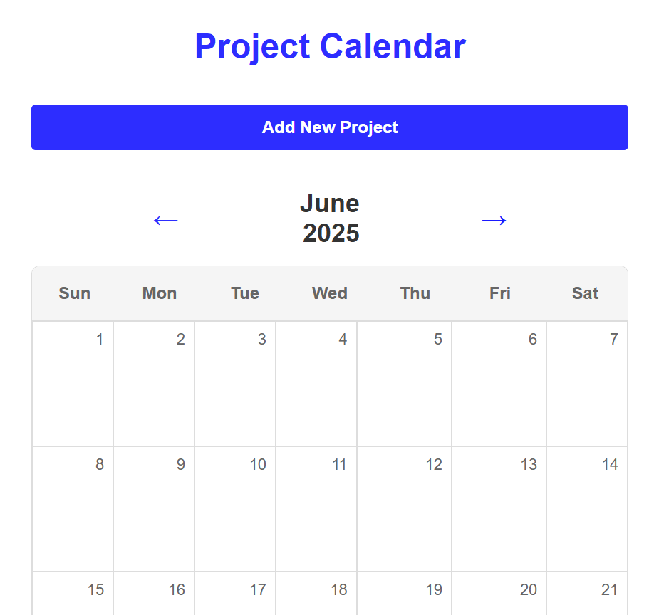
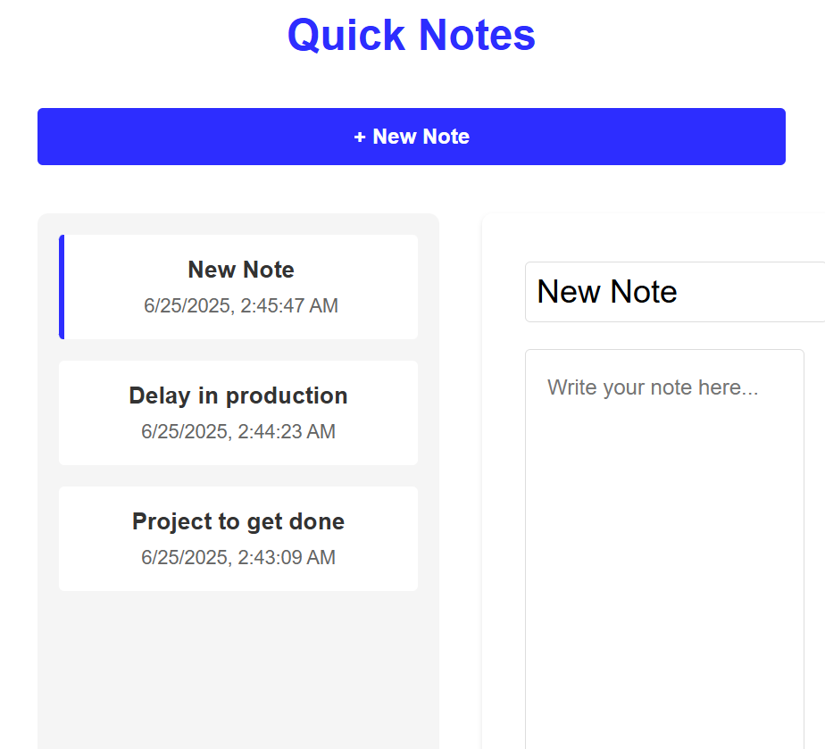

# Freelancer Toolkit

A small productivity suite built for freelancers and independent creators. This toolkit includes a basic invoice generator, a personal notes section, and a simple interactive calendar — all designed with minimal, customizable HTML.
## Features

### 📅 Project Calendar
- Visual calendar view of project timelines
- Add, edit, and delete projects
- Track project status (Not Started, In Progress, Completed)
- Automatic date calculations
- Local storage persistence

### 🧾 Invoice Generator
- Create professional invoices
- Customize invoice details
- Export invoices as PDF
- Save invoice templates
- Calculate totals automatically

### 📝 Quick Notes
- Create and manage notes
- Rich text editing
- Automatic saving
- Local storage persistence
- Quick access to important information

## 📸 Screenshots

### 🧾 Invoice Generator


### 📅 Calendar


### 🗒️ Notes Section



### Installation

1. Clone the repository:
```bash
git clone https://github.com/yourusername/freelancer-toolkit.git
cd freelancer-toolkit
```

2. Install dependencies:
```bash
npm install
```

3. Start the development server:
```bash
npm start
```

4. Open [http://localhost:3000](http://localhost:3000) to view it in the browser.

## Usage

### Project Calendar
- Click "Add New Project" to create a project
- Set start and end dates
- Update project status as you progress
- View projects in calendar or list view

### Invoice Generator
- Fill in client and project details
- Add line items with descriptions and amounts
- Preview the invoice
- Export as PDF

### Quick Notes
- Create new notes using the "+" button
- Edit notes by clicking on them
- Delete notes using the trash icon
- All changes are automatically saved

### About the Author
Built by UncleB77, a frontend developer creating useful tools for real-world freelance work.
Reach out for freelance collaborations or contributions.
